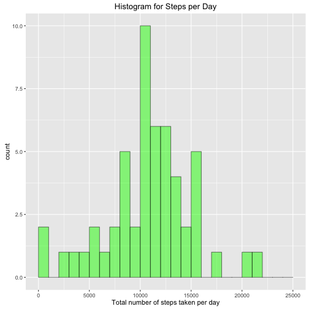
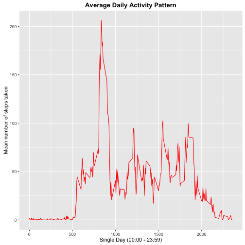
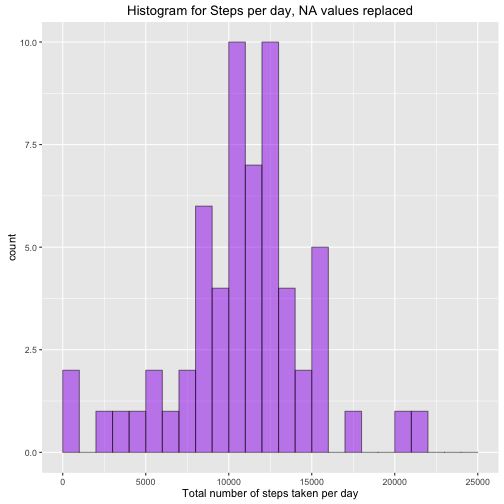
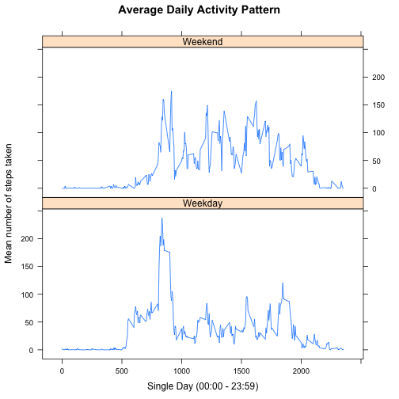

The data for this assignment can be downloaded from the course web site:      
Dataset: [Activity monitoring data [52K]](https://d396qusza40orc.cloudfront.net/repdata%2Fdata%2Factivity.zip)

      
    
# **Loading and Processing the Data**      
## 1. Code for reading in the dataset and processing the data      

```r
library(ggplot2) ## load lggplot2
    library(dplyr) ## load dplyr
    library(lattice) ## load lattice 
    filename <- "activity.zip"
    
    if (!file.exists(filename)){
        fileURL <- "https://d396qusza40orc.cloudfront.net/repdata%2Fdata%2Factivity.zip"
        download.file(fileURL, filename, method="curl")
    }  
    if (!file.exists("activity.csv")) { 
        unzip(filename) 
    }    
    
    activity <- read.csv("activity.csv", stringsAsFactors = FALSE) ## import
    activity$date <- as.POSIXct(activity$date, format = "%Y-%m-%d") ##date
    head(activity)
```

```
##   steps       date interval
## 1    NA 2012-10-01        0
## 2    NA 2012-10-01        5
## 3    NA 2012-10-01       10
## 4    NA 2012-10-01       15
## 5    NA 2012-10-01       20
## 6    NA 2012-10-01       25
```
---
---
# **What is mean total number of steps taken per day?**      
For this part of the assignment, you can ignore the missing values in the dataset. 

## 2. Histogram of the total number of steps taken each day    

```r
    ## calculate steps per day
    sum.steps <- aggregate(activity$steps, list(activity$date), sum)
    ## rename columns
    colnames(sum.steps) <- c("date", "per_day")
    ## Make a histogram of the total number of steps taken each day
    qplot(sum.steps$per_day, geom = "histogram", 
          main = "Histogram for Steps per Day", 
          xlab = "Total number of steps taken per day", 
          fill = I("green"), 
          col = I("black"), 
          xlim = c(0, 25000), 
          ylim = c(0, 10), 
          binwidth = 1000, 
          alpha = I(0.5))
```

 

## 3. Mean and median number of steps taken each day


```r
    round(mean(sum.steps$per_day, na.rm = TRUE), digits = 0) ## 10766
```

```
## [1] 10766
```

```r
    round(median(sum.steps$per_day, na.rm = TRUE), digits = 0) ##10765
```

```
## [1] 10765
```

*The mean number of steps taken in a day is **10,766***      
*The median number of steps taken in a day is **10,765***     

# **What is the average Daily Activity Pattern?** 


## 4. Time series plot of the average number of steps taken 


```r
    ## calculate mean number of steps per 5 minute interval
    mean.steps <- aggregate(activity$steps, list(activity$interval), mean, na.rm = TRUE)
    ## rename columns and set to numeric
    colnames(mean.steps) <- c("interval", "avg")
    mean.steps$interval <- as.numeric(mean.steps$interval)
    mean.steps$avg <- as.numeric(mean.steps$avg)
    ## create time-series plot 
    ggplot(mean.steps, aes(interval, avg)) + 
        geom_line(colour = "red") + 
        xlab("Single Day (00:00 - 23:59)") + 
        ylab("Mean number of steps taken") + 
        ggtitle("Average Daily Activity Pattern") + 
        theme(plot.title = element_text(lineheight = 1.0, face = "bold"))
```

 

## 5. The 5-minute interval that, on average, contains the maximum number of steps


```r
max.mean.steps <- which.max(mean.steps$avg) ## gives row of max avg
    round(mean.steps[max.mean.steps, ],digits=0) ## gives interval of max avg
```

```
##     interval avg
## 104      835 206
```

*The 5 minute interval with the maximum number of steps is **835** with **206** steps.*  

# **Imputing missing values** 

## 6. Code to describe and show a strategy for imputing missing data


```r
    ## Find where the NA's are and print length
    na.activity <- which(is.na(activity$steps)) ## vector of NA's
    length(na.activity)
```

```
## [1] 2304
```

*The total number of rows with NAs is **2304***      

####My strategy for filling in all of the missing values in the dataset: My thinking is that the NAs should be the mean for that specific day/interval (e.g mean of all other Monday @ 105 should fill the NA in Monday 105).


```r
    ## create days of the week and set levels
    activity$days <- weekdays(activity$date) 
    activity$days <- factor(activity$days, levels = 
                                c("Monday", 
                                  "Tuesday", 
                                  "Wednesday", 
                                  "Thursday", 
                                  "Friday", 
                                  "Saturday", 
                                  "Sunday"))
    
    #using dplyr in order to group by the day then the time interval
    dt.avg.activity <- group_by(activity, days, interval)
    dt.avg.activity <- summarise(dt.avg.activity, mean(steps, na.rm = TRUE))
    
    ## merge dt.avg.activity with activity to create new data frame
    activity.avg <- merge(activity, dt.avg.activity, by = c("days","interval"))
    ##rename column
    colnames(activity.avg)[5] <- "mean"
    
    
    ## Create a new dataset that is equal to the original dataset but with the 
    ## missing data filled in.
    activity.avg$steps <- ifelse(is.na(activity.avg$steps),
                                 activity.avg$mean,
                                 activity.avg$steps)
    head(activity.avg)
```

```
##     days interval steps       date mean
## 1 Friday        0     0 2012-10-19    0
## 2 Friday        0     0 2012-10-05    0
## 3 Friday        0     0 2012-11-30    0
## 4 Friday        0     0 2012-10-12    0
## 5 Friday        0     0 2012-11-16    0
## 6 Friday        0     0 2012-10-26    0
```

##7. Histogram of the total number of steps taken each day after missing values are imputed


```r
    ## sum the daily steps and make a new histogram of total number of steps taken each day
    sum.steps.namean <- aggregate(activity.avg$steps, list(activity.avg$date),sum)
    colnames(sum.steps.namean) <- c("date", "steps")
    
    qplot(sum.steps.namean$steps, geom = "histogram", 
          main = "Histogram for Steps per day, NA values replaced", 
          xlab = "Total number of steps taken per day", 
          fill = I("purple"), 
          col = I("black"), 
          xlim = c(0, 25000), 
          ylim = c(0, 10), 
          binwidth = 1000, 
          alpha = I(0.5))
```

 

Mean and median number of steps taken each day


```r
    round(mean(sum.steps.namean$steps), digits = 0) 
```

```
## [1] 10821
```

```r
    round(median(sum.steps.namean$steps), digits = 0)
```

```
## [1] 11015
```

*The mean number of steps taken in a day is **10,821***      
*The median number of steps taken in a day is **11,015***      

####The percentage change in the mean is 0.51% the percentage change in the median is 2.32%. It would appear my idea of using both the day of the week and time interval had a small impact. Certainly someone could be within 2.5% of their raw average it is not so ridiculous a statement to make.      

#**Are there differences in activity patterns between weekdays and weekends?**      

##8. Panel plot comparing the average number of steps taken per 5-minute interval across weekdays and weekends    


```r
    ## create new factor variable with two levels "weekend" and "weekday"
    activity.avg$type <- ifelse(activity.avg$days == "Saturday" | 
                                    activity.avg$days == "Sunday",
                                     "Weekend", "Weekday")
    
    
    ## calculate mean number of steps per 5 minute interval
    mean.steps.namean <- aggregate(activity.avg$steps, list(activity.avg$interval, activity.avg$type), mean)
    
    ## rename columns and set to numeric
    colnames(mean.steps.namean) <- c("interval", "type", "steps")
    mean.steps.namean$interval <- as.numeric(mean.steps.namean$interval)
    mean.steps.namean$steps <- as.numeric(mean.steps.namean$steps)
    
    ## create time-series plot using lattice
    xyplot(steps ~ interval | type, 
           mean.steps.namean, 
           type = "l",
           layout = c(1,2),
           xlab = "Single Day (00:00 - 23:59)",
           ylab = "Mean number of steps taken",
           main = "Average Daily Activity Pattern")
```

 

